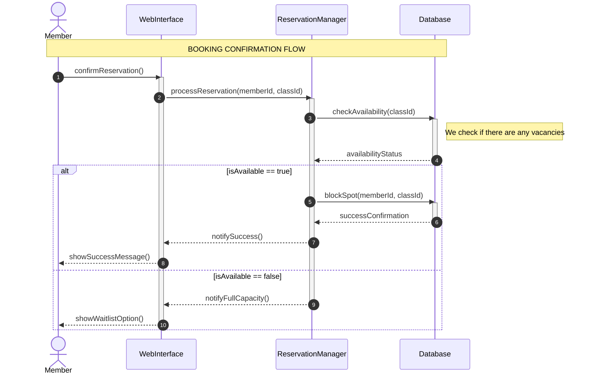
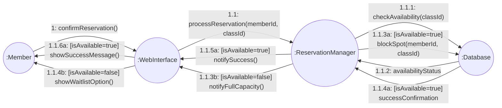
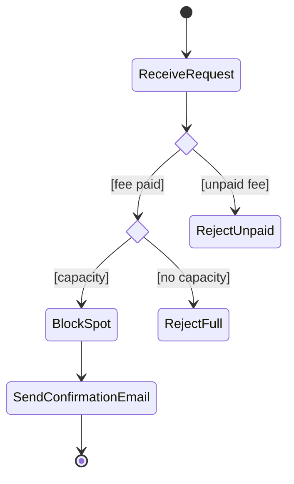

# Entornos-7.5 - GymMaster

## Fase 1: Análisis de Requisitos (Criterios a, b)
El sistema debe permitir que los **Socios** se identifiquen y reserven clases (como Yoga o Crossfit). Si una clase está llena, el socio puede apuntarse a una **Lista de Espera**. El **Administrador** debe poder dar de alta nuevas clases y cancelar sesiones si el monitor no asiste.

**Tarea 1:** Elabora el **Diagrama de Casos de Uso**.

* Identifica al menos 2 actores.
* Incluye relaciones &lt;&lt;include&gt;&gt; (ej. para el login) y &lt;&lt;extend&gt;&gt; (ej. para la lista de espera).
* Define el límite del sistema.

---

## Fase 2: Diseño de la Interacción (Criterios c, d)
Nos centramos en el momento exacto en que un Socio pulsa el botón "Confirmar Reserva".

**Tarea 2:** Elabora un **Diagrama de Secuencia** para el proceso Confirmar Reserva.

* **Objetos involucrados:** :Socio, :InterfazWeb, :GestorReservas, :BaseDatos.
* **Flujo:** El socio envía la petición; el gestor comprueba disponibilidad en la BD; la BD responde; el gestor confirma y la interfaz muestra el mensaje de éxito.
* **Nota:** Usa fragmentos combinados (alt o opt) para gestionar qué pasa si no hay hueco.

**Tarea 3:** Elabora un **Diagrama de Comunicación** equivalente al anterior.

* Muestra la misma interacción pero enfocada en los enlaces entre objetos.
* Utiliza correctamente la numeración decimal (1, 1.1, 2...) para el orden de los mensajes.

---

## Fase 3: Lógica del Proceso (Criterios e, f)
Antes de confirmar la reserva, el gimnasio sigue un protocolo interno de seguridad y pagos.

**Tarea 4:** Elabora un **Diagrama de Actividades** para el flujo Validación de Reserva.

* **Pasos:** 1. Recibir solicitud -> 2. ¿Socio tiene cuota pagada? (Decisión) -> 3. ¿Hay aforo? (Decisión) -> 4. Bloquear plaza -> 5. Enviar email de confirmación.
* Usa correctamente los símbolos de inicio, fin, acciones y rombos de decisión.

