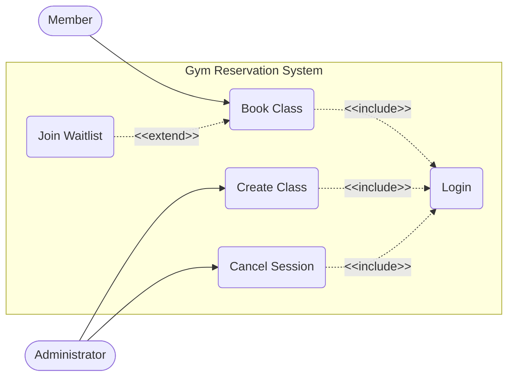

# Entornos-7.5 - GymMaster

## Fase 1: Análisis de Requisitos (Criterios a, b)
El sistema debe permitir que los **Socios** se identifiquen y reserven clases (como Yoga o Crossfit). Si una clase está llena, el socio puede apuntarse a una **Lista de Espera**. El **Administrador** debe poder dar de alta nuevas clases y cancelar sesiones si el monitor no asiste.

**Tarea 1:** Elabora el **Diagrama de Casos de Uso**.

* Identifica al menos 2 actores.
* Incluye relaciones <<include>> (ej. para el login) y <<extend>> (ej. para la lista de espera).
* Define el límite del sistema.

---

